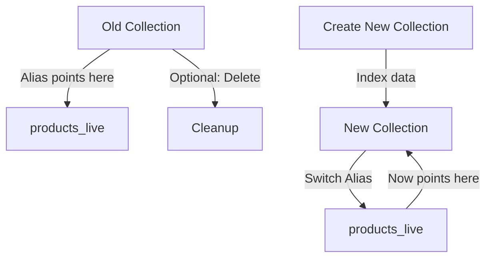

## Overview

The `migrate` command enables zero-downtime schema migrations using blue/green deployment strategy. It creates a new versioned collection, allows you to index data, then switches an alias to point to the new collection.

## Syntax

```bash
tsctl migrate [options]
```

## Required Options

<ParamField path="--alias" type="string" required>
  The alias to migrate. This is the stable name your application uses to query the collection.
</ParamField>

<ParamField path="-a" type="string" required>
  Short alias for `--alias`.
</ParamField>

<ParamField path="--config" type="string" required>
  Path to config file containing the collection schema.
</ParamField>

<ParamField path="-c" type="string" required>
  Short alias for `--config`.
</ParamField>

## Optional Flags

<ParamField path="--collection" type="string">
  Collection name from config to migrate (required if config has multiple collections).
</ParamField>

<ParamField path="--skip-delete" type="boolean" default="false">
  Keep the old collection after migration completes. Useful for rollback scenarios.
</ParamField>

<ParamField path="--yes" type="boolean" default="false">
  Auto-approve migration without prompting for confirmation.
</ParamField>

<ParamField path="-y" type="boolean" default="false">
  Short alias for `--yes`.
</ParamField>

<ParamField path="--create-only" type="boolean" default="false">
  Only create the new collection without switching the alias. Use this to create and index the collection before going live.
</ParamField>

<ParamField path="--switch-only" type="boolean" default="false">
  Only switch the alias to the latest collection. Use this after indexing is complete.
</ParamField>

<ParamField path="--cleanup" type="string">
  Delete a specific old collection by name after successful migration.
</ParamField>

<ParamField path="--env" type="string">
  Environment to use (loads `.env.<environment>`).
</ParamField>

## Behavior

### Full Migration (default)

1. **Plans the migration** - Determines the new collection name with timestamp
2. **Creates new collection** - With the updated schema from config
3. **Copies data** - You index data into the new collection (or use `--create-only` workflow)
4. **Switches alias** - Points alias to new collection atomically
5. **Deletes old collection** - Unless `--skip-delete` is used

### Create-Only Workflow

1. **Creates new collection** - With timestamp-based name
2. **Stops and waits** - Allows you to index data manually
3. **Provides next command** - Shows how to complete migration with `--switch-only`

### Switch-Only Workflow

1. **Finds latest collection** - Locates the most recent timestamped version
2. **Switches alias** - Updates alias to point to new collection
3. **Keeps old collection** - Available for rollback

## Examples

### Full migration (automated)

```bash
tsctl migrate -a products_live -c tsctl.config.ts
```

**Output:**
```
✓ Config loaded
✓ Migration planned

Migration Plan:

  Alias: products_live
  Current collection: products_20260301_143022
  New collection: products_20260303_103045

  Steps:
    1. Create new collection 'products_20260303_103045'
    2. Switch alias 'products_live' → 'products_20260303_103045'
    3. Delete old collection 'products_20260301_143022'

Proceed with migration? (yes/no): yes

Executing migration...

  Step 1: Creating new collection...
  Step 2: Switching alias...
  Step 3: Deleting old collection...

✓ Migration completed successfully!
  New collection: products_20260303_103045
  Alias: products_live
```

### Create collection only (for manual indexing)

```bash
tsctl migrate -a products_live -c tsctl.config.ts --create-only
```

**Output:**
```
✓ Config loaded
✓ Migration planned

Migration Plan:

  Alias: products_live
  New collection: products_20260303_103045

  Steps:
    1. Create new collection 'products_20260303_103045'

Create the new collection? (yes/no): yes

✓ Created collection 'products_20260303_103045'

✓ Collection created. Index your data, then run:
  tsctl migrate -a products_live -c tsctl.config.ts --switch-only
```

### Switch alias to new collection

```bash
tsctl migrate -a products_live -c tsctl.config.ts --switch-only
```

**Output:**
```
✓ Config loaded
✓ Migration planned

Switch alias 'products_live' to the latest collection? (yes/no): yes

✓ Switched alias 'products_live' to 'products_20260303_103045'

✓ Migration complete. Old collection still exists for rollback.
  To delete the old collection:
  tsctl migrate -a products_live -c tsctl.config.ts --cleanup products_20260301_143022
```

### Keep old collection for rollback

```bash
tsctl migrate -a products_live -c tsctl.config.ts --skip-delete
```

**Output:**
```
✓ Migration completed successfully!
  New collection: products_20260303_103045
  Alias: products_live

  Old collection 'products_20260301_143022' was kept for rollback.
  To delete it later:
  tsctl migrate -a products_live -c tsctl.config.ts --cleanup products_20260301_143022
```

### Clean up old collection

```bash
tsctl migrate -a products_live -c tsctl.config.ts --cleanup products_20260301_143022
```

**Output:**
```
✓ Deleted collection 'products_20260301_143022'
```

### Multiple collections in config

```bash
tsctl migrate -a products_live -c tsctl.config.ts --collection products
```

## Migration Workflow

### Zero-Downtime Migration Process



### Recommended Workflow

<Steps>
  <Step title="Create new collection">
    ```bash
    tsctl migrate -a products_live -c tsctl.config.ts --create-only
    ```
    
    This creates `products_20260303_103045` with your new schema.
  </Step>

  <Step title="Index data into new collection">
    ```bash
    # Use your data pipeline to index into the new collection
    # Application still queries via 'products_live' alias (points to old collection)
    node scripts/index-data.js products_20260303_103045
    ```
  </Step>

  <Step title="Verify new collection">
    ```bash
    # Test queries against new collection directly
    curl "http://localhost:8108/collections/products_20260303_103045/documents/search?q=test"
    ```
  </Step>

  <Step title="Switch alias (go live)">
    ```bash
    tsctl migrate -a products_live -c tsctl.config.ts --switch-only
    ```
    
    The alias now points to the new collection. This is atomic and instant.
  </Step>

  <Step title="Monitor and optionally rollback">
    If issues arise, rollback by switching the alias back:
    
    ```bash
    # Manual rollback via Typesense API
    curl -X PATCH "http://localhost:8108/aliases/products_live" \
      -d '{"collection_name": "products_20260301_143022"}'
    ```
  </Step>

  <Step title="Clean up old collection">
    ```bash
    tsctl migrate -a products_live -c tsctl.config.ts --cleanup products_20260301_143022
    ```
  </Step>
</Steps>

## Collection Naming

tsctl uses timestamp-based versioning for collections:

```
products_20260303_103045
└─────┘ └──────┘ └────┘
   │        │       │
base     date     time
 name   (YYYYMMDD) (HHMMSS)
```

This ensures:
- **Chronological ordering** - Sort by name to find latest
- **Unique names** - No conflicts from parallel migrations
- **Clear provenance** - Know when each version was created

## Use Cases

<AccordionGroup>
  <Accordion title="Schema updates">
    Update field types, add/remove fields, change sorting:
    
    ```bash
    # Update tsctl.config.ts with new schema
    tsctl migrate -a products_live -c tsctl.config.ts --create-only
    # Index data
    tsctl migrate -a products_live -c tsctl.config.ts --switch-only
    ```
  </Accordion>

  <Accordion title="Reindexing data">
    Re-index with fresh data without downtime:
    
    ```bash
    tsctl migrate -a products_live -c tsctl.config.ts --create-only
    # Run full reindex into new collection
    tsctl migrate -a products_live -c tsctl.config.ts --switch-only
    ```
  </Accordion>

  <Accordion title="Testing schema changes">
    Create a new version to test without affecting production:
    
    ```bash
    tsctl migrate -a products_live -c new-schema.config.ts --create-only
    # Test against products_YYYYMMDD_HHMMSS directly
    # Don't switch if tests fail
    tsctl migrate -a products_live -c new-schema.config.ts --cleanup products_YYYYMMDD_HHMMSS
    ```
  </Accordion>

  <Accordion title="Rollback capability">
    Keep old collections for quick rollback:
    
    ```bash
    tsctl migrate -a products_live -c tsctl.config.ts --skip-delete
    # If issues occur, manually switch alias back
    # After stability, clean up:
    tsctl migrate -a products_live -c tsctl.config.ts --cleanup products_OLD
    ```
  </Accordion>
</AccordionGroup>

## Safety and Best Practices

<Warning>
  **Best practices for safe migrations:**
  
  1. **Always use create-only + switch-only** for production migrations
  2. **Test thoroughly** before switching the alias
  3. **Keep old collections** with `--skip-delete` for rollback
  4. **Monitor after switching** to catch issues early
  5. **Clean up gradually** - don't immediately delete old collections
</Warning>

## Comparison with tsctl apply

| Aspect | migrate | apply |
|--------|---------|-------|
| **Downtime** | Zero | Possible |
| **Strategy** | Blue/green | In-place update |
| **Rollback** | Easy (switch alias) | Difficult |
| **Use case** | Breaking changes | Minor updates |
| **Data** | Manual reindex | Preserved |

Use **migrate** for:
- Breaking schema changes
- Production deployments
- When downtime is unacceptable

Use **apply** for:
- Adding optional fields
- Non-breaking updates
- Development/staging

## Next Steps

After migration:

1. Monitor application performance
2. Verify data completeness in new collection
3. Keep old collection for 24-48 hours
4. Clean up old collections with `--cleanup`
5. Update monitoring/alerts for new collection name
